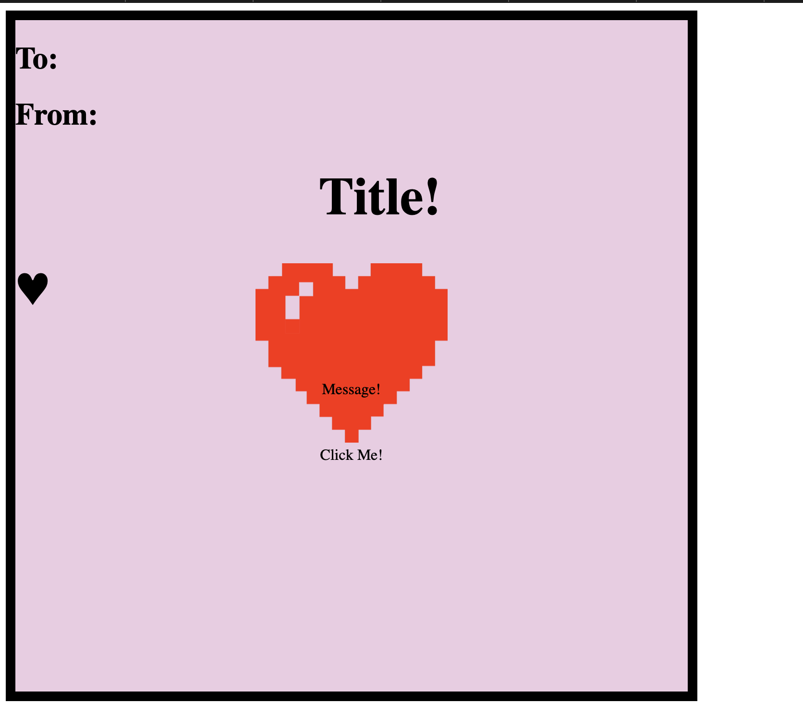

### WIC Valentines 
Learn some HTML/CSS commands while making a cute ecard!  

____________________________________________________________________________________
To start:

Open ValentineHTML.html document in an IDE:

To open in broswer, go to finder where your html doc is saved, right click on document, click "open in BROWSER":

You should see something like the picture above.

____________________________________________________________________________________

