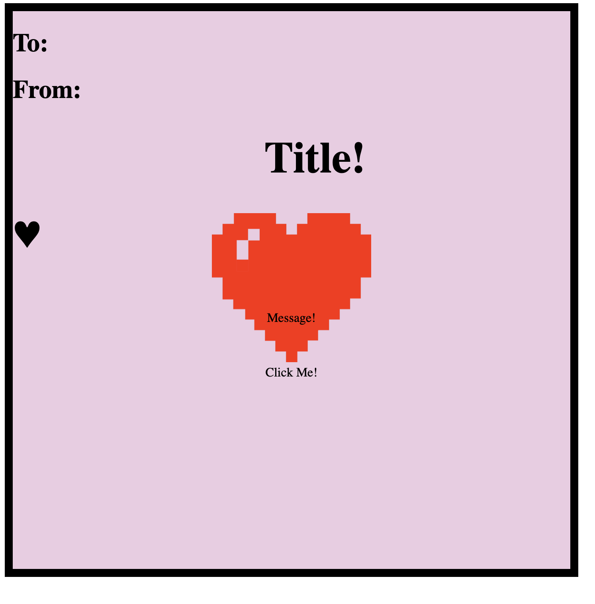
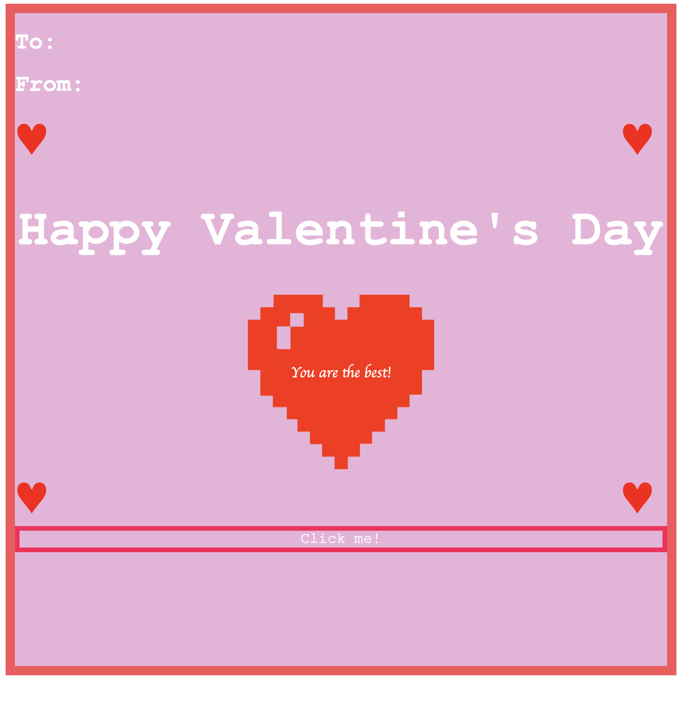

#  💖 WIC Valentines 💖 <br/>
Learn some HTML/CSS commands while making a cute ecard! <br/>
____________________________________________________________________________________
## To Start:<br/>

Open ValentineHTML.html document in an IDE:

To open in broswer, go to finder where your html doc is saved, right click on document, click "open in BROWSER":

<p align="center">
 
</p>

You should see something like the picture above.


Eventually we will be able to turn this mediocre e-card to something like below:

<p align="center">
 
</p>

Before we begin it will be helpful to look at what HTML and CSS is.
____________________________________________________________________________________
##### HTML:
HTML is a sandard markup langauge to create web pages

https://www.w3schools.com/html/html_intro.asp
____________________________________________________________________________________
#####  CSS: 

CSS is a language that describes the style of HTML 

https://www.w3schools.com/css/

____________________________________________________________________________________
## Changing the look of your HTML file with CSS: <br/>

##### To change background:
```
 .background {
        position: relative;
        background-color: rgb(236, 203, 226);
        border: 10px solid black;
        width: 700px;
        height: 700px;
    }
``` 

In this background class:
- To change the background color of your document, use the function "background-color" 
- If you want to change the color of the border, use the function "border" and follow it with: " 'Depth of Border'px solid 'color'"
- The width and Height functions will change the dimensions of your background. 

##### To change font size and color:
```
   .title {
        font-size: 55px;
        margin-left: 60px;
        text-align: center;
    }
``` 
- Font Size: changes the font size of your text
- color: will change the color of your text (not highlighted in the above example)
- text-align: makes the words center, left indented, or right indented
- margin-left: gives 60px margin to the left of the text

##### Resizing images/pictures:

You might notice that when you change the text of your card,the text will get out of wack.
The reason this happens is because currently in our title class, we have hard-coded where the title should go. To prevent this from happening we should make out title card *dyanmic*, meaning it will change as the card dimenisons or text changes. </br>


```
 .title {
        font-size: 55px;
        margin-left: 60px;
        text-align: center;
    }
```

Currently we hardcoded margin-left to 60px, based 

##### Images:
```
   .picture {
        margin-left: 250px;
        width: 200px;
    }

    

``` 

Here we are provding an image to have a width of 200px, and be indented 250px from the left. 


##### Button:

The button can be used for a variety of things, most common use of a button on a website would be to open to new pages. 

```
 <div class="button" onclick="alert('Hello world!')">Click Me! </div>
```

In our valentine, it will be used as a "pop up" to print out a suprise message for the reciever of your valentine. <br/>
____________________________________________________________________________________
## This isn't all! <br/>
To find out how to change more items on your card go to  https://www.w3schools.com/! 
There is a lot of helpful tools and examples of how these tools work on this webstie :)
____________________________________________________________________________________
Last Update: Feb 9, 2021


